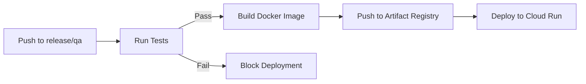

# Cottonbro

Cottonbro lets creators design merch (tees, beanies, crop tops, etc.), render them on real-body previews, and share purchasable links. We manage printing, payments, and delivery so creators only focus on their brand.

## Tech Stack

### Core Technologies

| Layer | Technology | Version |
|-------|------------|---------|
| **Frontend** | Next.js (App Router) | 15.5 |
| **React** | React | 19.2 |
| **3D Rendering** | Three.js + React Three Fiber | 0.181 |
| **Styling** | Tailwind CSS | 4.1 |
| **Animation** | Framer Motion | 12.23 |
| **Backend** | NestJS | 11.1 |
| **Runtime** | Node.js | 22.x |
| **Authentication** | Firebase Admin SDK | 11.10 |
| **Email** | Nodemailer + AWS SES | 7.0 |
| **Captcha** | Cloudflare Turnstile | — |

### Monorepo & Tooling

- **Package Manager**: pnpm 10 with workspaces
- **Build Orchestration**: Turborepo 2.5
- **Language**: TypeScript 5.9 (strict mode)
- **Linting**: ESLint 9 + Prettier 3
- **Git Hooks**: Husky + Commitlint

### Testing

| Type | Framework | Location |
|------|-----------|----------|
| **API Unit Tests** | Jest 30 + NestJS Testing | `apps/api/test/` |
| **UI Component Tests** | Vitest 4 + Testing Library | `packages/frontend/ui/src/__tests__/` |
| **E2E Tests** | Playwright 1.57 | `apps/web/e2e/` |

### Infrastructure

- **Cloud Platform**: Google Cloud Run
- **Container Registry**: Artifact Registry
- **CI/CD**: GitHub Actions (tests run before deploy)
- **Auth Federation**: Workload Identity Federation (keyless)
- **Secrets**: GCP Secret Manager

---

## Packages Layout

```
cottonbro/
├── apps/
│   ├── api/          # NestJS backend (Auth, OTP, Sessions)
│   └── web/          # Next.js frontend (Marketing + Studio)
├── packages/
│   ├── core/
│   │   ├── contracts/  # Shared Zod schemas
│   │   ├── utils/      # Common utilities
│   │   ├── pricing/    # Pricing logic
│   │   └── orders/     # Order management
│   ├── frontend/
│   │   ├── ui/         # React component library
│   │   └── auth-react/ # Firebase auth hooks
│   └── backend/
│       ├── auth-server/  # Firebase Admin helpers
│       └── jobs/         # Background jobs
└── .github/workflows/    # CI/CD pipelines
```

---

## Commands

### Development

| Purpose | Command |
|---------|---------|
| Start all services | `pnpm dev` |
| Web dev server | `pnpm --filter @cottonbro/web dev` |
| API dev server | `pnpm --filter @cottonbro/api dev` |
| Build all | `pnpm build` |

### Testing

| Purpose | Command |
|---------|---------|
| Run all tests | `pnpm test` |
| API unit tests | `pnpm --filter @cottonbro/api test` |
| UI component tests | `pnpm --filter @cottonbro/ui test` |
| E2E tests | `pnpm --filter @cottonbro/web test:e2e` |
| E2E with UI | `pnpm --filter @cottonbro/web test:e2e:ui` |

### Linting & Type Checking

| Purpose | Command |
|---------|---------|
| Lint all | `pnpm lint` |
| Type check all | `pnpm typecheck` |

---

## Docker Quickstart

```bash
# Web (QA env)
docker build -f apps/web/Dockerfile --build-arg APP_ENV=qa -t cottonbro-web:qa .
docker run --rm -p 5173:5173 -e APP_ENV=qa cottonbro-web:qa

# API (QA env)
docker build -f apps/api/Dockerfile --build-arg APP_ENV=qa -t cottonbro-api:qa .
docker run --rm -p 3001:3001 -e APP_ENV=qa cottonbro-api:qa
```

---

## CI/CD Pipeline



Tests must pass before deployment. See `.github/workflows/` for details.

---

## Environment Setup

1. Copy env templates:
   ```bash
   cp apps/api/.env.example apps/api/.env.local
   cp apps/web/.env.qa.local.example apps/web/.env.qa.local
   ```

2. Fill in required secrets (Firebase, Turnstile, SMTP)

3. Install dependencies:
   ```bash
   pnpm install
   ```

4. Start development:
   ```bash
   pnpm dev
   ```
