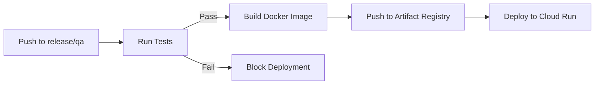

# Cottonbro

Cottonbro lets creators design merch (tees, beanies, crop tops, etc.), render them on real-body previews, and share purchasable links. We manage printing, payments, and delivery so creators only focus on their brand.

## Tech Stack

### Core Technologies

| Layer | Technology | Version |
|-------|------------|---------|
| **Frontend** | Next.js (App Router) | 15.5 |
| **React** | React | 19.2 |
| **Canvas Editor** | Fabric.js | 6.x |
| **Styling** | Tailwind CSS | 4.1 |
| **Animation** | Framer Motion | 12.23 |
| **Backend API** | NestJS | 11.1 |
| **Python Services** | FastAPI | 0.115 |
| **Runtime** | Node.js 24.x / Python 3.11 |
| **Authentication** | Firebase Admin SDK | 11.10 |
| **Email** | Nodemailer + Zoho SMTP | 7.0 |
| **Captcha** | Cloudflare Turnstile | — |

### Python Services

| Service | Purpose |
|---------|---------|
| **Background Removal** | AI-powered image transparency using rembg/ONNX |

### Authentication Architecture

```
Frontend (Firebase Client) 
    ↓ Bearer Token (ID Token)
NestJS API (AuthGuard verifies token)
    ↓ X-API-Key header
Python Services (API key middleware)
```

### Design System

- **Primary Accent**: Glacier Blue (`#93C5FD`)
- **Background**: Deep Black (`#030303`)
- **Typography**: Urbanist font family
- **Style**: Premium dark mode with subtle glows

### Monorepo & Tooling

- **Package Manager**: pnpm 10 with workspaces
- **Build Orchestration**: Turborepo 2.5
- **Language**: TypeScript 5.9 (strict mode) / Python 3.11
- **Linting**: ESLint 9 + Prettier 3
- **Git Hooks**: Husky + Commitlint

### Testing

| Type | Framework | Location |
|------|-----------|----------|
| **API Unit Tests** | Jest 30 + NestJS Testing | `apps/api/test/` |
| **UI Component Tests** | Vitest 4 + Testing Library | `packages/frontend/ui/src/__tests__/` |
| **E2E Tests** | Playwright 1.57 | `apps/web/e2e/` |

### Infrastructure

- **Cloud Platform**: Google Cloud Run
- **Container Registry**: Artifact Registry
- **CI/CD**: GitHub Actions (tests run before deploy)
- **Auth Federation**: Workload Identity Federation (keyless)
- **Secrets**: GCP Secret Manager

---

## Architecture

### Deployment Topology

```text
                   ┌─────────────────────────────┐
                   │   Users (Uganda / EA / EU)  │
                   └──────────────┬──────────────┘
                                  │
                                  ▼
                   ┌─────────────────────────────┐
                   │ Cloudflare CDN / Edge Cache │
                   │ - cache images              │
                   │ - cache static assets       │
                   │ - optional HTML caching     │
                   └──────────────┬──────────────┘
                                  │
                                  ▼
                ┌──────────────────────────────────────┐
                │ Next.js Frontend on Cloud Run        │
                │ region: europe-west1 (Belgium)       │
                │ - SSR / ISR / app routes             │
                │ - calls API                          │
                └──────────────┬───────────────────────┘
                               │
                               ▼
                ┌──────────────────────────────────────┐
                │ NestJS API on Cloud Run              │
                │ region: europe-west1 (Belgium)       │
                │ - auth                               │
                │ - products / cart / orders           │
                │ - payments / admin                   │
                │ - generates signed upload URLs       │
                └───────────┬───────────────┬──────────┘
                            │               │
                            │               ▼
                            │     ┌──────────────────────┐
                            │     │ Cloudflare R2        │
                            │     │ - product images     │
                            │     │ - uploads/media      │
                            │     └──────────────────────┘
                            │
                            ▼
              ┌────────────────────────────────────────────┐
              │ PostgreSQL                                 │
              │ Option A: Neon (recommended now)           │
              │ Option B: Cloud SQL (boring upgrade path)  │
              │ Option C: DO droplet (ops-heavy)           │
              └────────────────────────────────────────────┘
```

### Notes

- Cloudflare is the edge layer for static assets, image caching, and optional cached HTML responses.
- The Next.js frontend and NestJS API are both hosted on Cloud Run in `europe-west1`.
- The API is responsible for auth, commerce flows, admin operations, and signed upload URL generation.
- Product and upload media are stored in Cloudflare R2.
- PostgreSQL is expected to run on Neon initially, with Cloud SQL as the low-friction managed migration path.

---

## Packages Layout

```
cottonbro/
├── apps/
│   ├── api/              # NestJS backend (Auth, OTP, Sessions, Image Proxy)
│   ├── web/              # Next.js frontend (Marketing + Studio + Editor)
│   └── python-services/  # FastAPI (Background Removal, Image Processing)
├── packages/
│   ├── core/
│   │   ├── contracts/    # Shared Zod schemas
│   │   ├── utils/        # Common utilities
│   │   ├── pricing/      # Pricing logic
│   │   └── orders/       # Order management
│   ├── frontend/
│   │   ├── ui/           # React component library
│   │   └── auth-react/   # Firebase auth hooks
│   └── backend/
│       ├── auth-server/  # Firebase Admin helpers
│       └── jobs/         # Background jobs
└── .github/workflows/    # CI/CD pipelines
```

---

## Commands

### Development

| Purpose | Command |
|---------|---------|
| Start all services | `pnpm dev` |
| Web dev server | `pnpm --filter @cottonbro/web dev` |
| API dev server | `pnpm --filter @cottonbro/api dev` |
| Python services | `cd apps/python-services && uvicorn src.main:app --reload` |
| Build all | `pnpm build` |

### Testing

| Purpose | Command |
|---------|---------|
| Run all tests | `pnpm test` |
| API unit tests | `pnpm --filter @cottonbro/api test` |
| UI component tests | `pnpm --filter @cottonbro/ui test` |
| E2E tests | `pnpm --filter @cottonbro/web test:e2e` |
| E2E with UI | `pnpm --filter @cottonbro/web test:e2e:ui` |

### Linting & Type Checking

| Purpose | Command |
|---------|---------|
| Lint all | `pnpm lint` |
| Type check all | `pnpm typecheck` |

---

## Docker Quickstart

```bash
# Web (QA env)
docker build -f apps/web/Dockerfile \
  --build-arg APP_ENV=qa \
  --build-arg NEXT_PUBLIC_APP_ENV=qa \
  --build-arg NEXT_PUBLIC_AUTH_BASE_URL=https://qa-auth.example.com \
  --build-arg NEXT_PUBLIC_API_BASE_URL=https://qa-api.example.com \
  --build-arg NEXT_PUBLIC_FIREBASE_API_KEY=your-firebase-api-key \
  --build-arg NEXT_PUBLIC_FIREBASE_AUTH_DOMAIN=your-project.firebaseapp.com \
  --build-arg NEXT_PUBLIC_FIREBASE_PROJECT_ID=your-project-id \
  --build-arg NEXT_PUBLIC_FIREBASE_APP_ID=your-firebase-app-id \
  --build-arg NEXT_PUBLIC_FIREBASE_MESSAGING_SENDER_ID=your-sender-id \
  --build-arg NEXT_PUBLIC_FIREBASE_STORAGE_BUCKET=your-project.appspot.com \
  --build-arg NEXT_PUBLIC_TURNSTILE_SITE_KEY=your-turnstile-site-key \
  -t cottonbro-web:qa .
docker run --rm -p 5173:5173 -e PORT=5173 -e APP_ENV=qa cottonbro-web:qa

# API (QA env)
docker build -f apps/api/Dockerfile --build-arg APP_ENV=qa -t cottonbro-api:qa .
docker run --rm -p 3001:8080 -e APP_ENV=qa cottonbro-api:qa

# Python Services
docker build -f apps/python-services/Dockerfile -t cottonbro-python:qa apps/python-services
docker run --rm -p 8000:8080 -e PORT=8080 -e PYTHON_API_KEY=your-key cottonbro-python:qa
```

---

## CI/CD Pipeline


```mermaid
graph LR
    A[Push to release/qa] --> B[Run Tests]
    B --> |Pass| C[Build Docker Image]
    C --> D[Push to Artifact Registry]
    D --> E[Deploy to Cloud Run]
    B --> |Fail| F[Block Deployment]
```

Tests must pass before deployment. See `.github/workflows/` for details.

---

## Environment Setup

1. Install prerequisites:
   ```bash
   corepack enable
   node --version   # should be v24.x
   pnpm --version
   ```

2. Copy env templates:
   ```bash
   cp apps/api/.env.example apps/api/.env.local
   ```

3. Create `apps/web/.env.qa.local` with the required public web vars:
   ```env
   APP_ENV=qa
   NEXT_PUBLIC_APP_ENV=qa
   NEXT_PUBLIC_FIREBASE_API_KEY=
   NEXT_PUBLIC_FIREBASE_AUTH_DOMAIN=
   NEXT_PUBLIC_FIREBASE_PROJECT_ID=
   NEXT_PUBLIC_FIREBASE_APP_ID=
   NEXT_PUBLIC_FIREBASE_MESSAGING_SENDER_ID=
   NEXT_PUBLIC_FIREBASE_STORAGE_BUCKET=
   NEXT_PUBLIC_AUTH_BASE_URL=
   NEXT_PUBLIC_API_BASE_URL=
   NEXT_PUBLIC_TURNSTILE_SITE_KEY=
   ```

4. Fill in required secrets (Firebase, Turnstile, SMTP)

5. Install dependencies:
   ```bash
   pnpm install
   ```

6. Start development:
   ```bash
   pnpm dev
   ```
